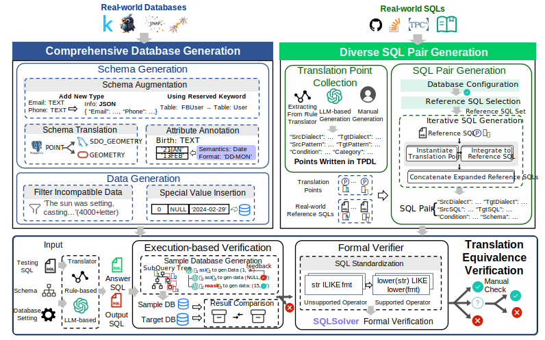

# SQL2SQLBench

SQL2SQLBench is a benchmark to test SQL dialect translators, and it is generally composed of three components (i.e., Dataset Construction, SQL Pair Generator, SQL Equivalence Verifier). We develop SQL2SQLBench to test the performance of existing dialect translators.

## System Overview

<p align="center">
    
</p>


## Installation

We have developed *SQL2SQL_Bench* based on Ubuntu 24.04,  MySQL v8.0, PostgreSQL v14 (with PostGIS v3.5.0 extension for spatial types), and Oracle 11g.

Clone this repository and install necessary dependencies:

```bash
conda env create -f environment.yml
conda activate sql2sqlbench-py310
```

## Quick Start

To get started with *SQL2SQLBench*, follow these steps:

### Step 1: Set up SQL2SQLBench
First, download the data used in our paper in [Google Drive](tbd), and write the file path to `data_path` in `src/config.ini`.

```ini
[FILE_PATH]
data_path = your data path
```

Run the python script to install the database:

```bash
cd src
python -m db_builder.create_db_script.py
```

Second, set your API keys in `src/config.ini`:

```ini
[API]
gpt_api_base = xxx
gpt_api_key = xxx
deepseek_api_base = xxx
deepseek_api_key = xxx
...
```

Third, set the database connection information in `src/config.ini`:

```ini
[ORACLE_CONN]
oracle_instant_path = your oracle instant client path
oracle_host = your oracle host
oracle_port = your oracle port
oracle_user = your oracle user
...
```

### Step 2: Generate SQL with certain translation points

Fill the configuration file in 'src/sql_gen/generate_config.json' to specify the parameters for SQL generation.

We offer two generation mode: **specified** and **random**.

- In **specified** mode, you can specify the translation points to be added in the SQL you want to generate. The generator will generate SQL queries with the specified translation points.

- In **random** mode, you can specify the number of translation points to be added in the SQL you want to generate. The generator will randomly select translation points from the collected translation points and generate SQL queries with the selected translation points.

Here are two examples of configuration file:

```json
{
  "mode": "specified",
  "src_dialect": "mysql",
  "tgt_dialect": "pg",
  "points": [
    {
      "point": "point_name",
      "num": "The number of this point"
    }
  ],
  "output_path": "The path to save the generated SQL files"
}
```

```json
{
  "mode": "random",
  "src_dialect": "mysql",
  "tgt_dialect": "pg",
  "point_num": "The point number to generate",
  "output_path": "The path to save the generated SQL files"
}
```

Run the python script to install the database:

```bash
cd src
python -m sql_gen.generate.py
```

### Step 3: Transpile SQL to target dialects using different dialect translators

### Step 4: Verify the correctness of the translated SQLs

## Code Structure
- `conv_point/`: The collected translation points.
- `sql/`: The collected real-world SQL queries.
- `exp_data/`: The experiment data.
- `src/`: The source code of *SQL2SQLBench*.
  - `antlr_parser`: The antlr parser and their syntax definition file used by *SQL2SQLBench*.
  - `db_builder`: The building script of the database employed in the *SQL2SQLBench*.
  - `sql_gen`: The generator of *SQL2SQLBench*.
  - `transpiler`: The running script of each dialect translator tested in the *SQL2SQLBench*.
  - `verification`: The verifier offered by *SQL2SQLBench*.
  - `config.ini`: The configuration file for *SQL2SQL_Bench*.

## Results

The results in `exp_data/individual` exhibit the experiment result of the individual point dataset.

The results in `exp_data/sql_len` exhibit the experiment result of each translator on SQL queries with varying length of additional segments (0, 100, 200, 300, 400, respectively). Specifically, each experiment corresponds to a separate file named according to the length of segments, e.g., sql_add_len_0.json, sql_add_len_100.json, sql_add_len_200.json, up to sql_add_len_400.json.

The results in `exp_data/multi-point` exhibit the experiment result of each translator on SQL queries with varying number of translation points (2 to 3, 4 to 5, 6 to 7, 8 to 9, and 10 to 11, respectively). Specifically, each experiment corresponds to a separate file named according to the length of segments, e.g., sql_points_2_3.json, sql_points_4_5.json, up to sql_points_10_11.json.

All data is stored in format:
```json
{
    "{SrcDialect}": "{SrcSQL}",
    "{TgtDialect}": "{TgtSQL}",
    "points": [
      {
        "point": "point name",
        "num": number of point
      },
      ...
    ],
    "tables": [
      "table used in the query"
    ],
    "exp_res": {
      "{Translator Name}": {
        "tran_res": "the translation result",
        "verify_res": "the verification result"
      },
      ...
    }
}
```


